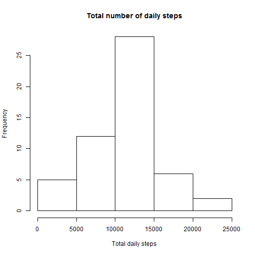
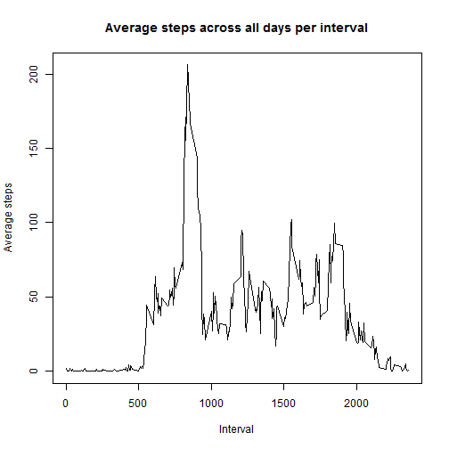
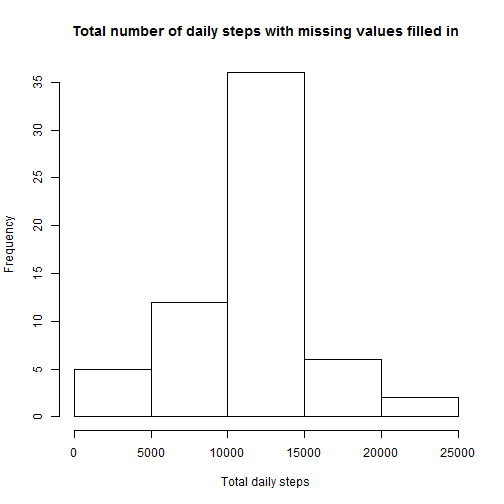
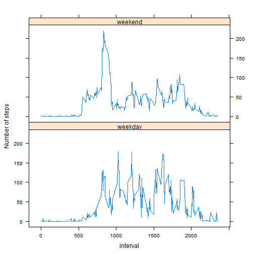

Project 1 for Reproducible Research  
===================================
  
  
##Loading and preprocessing the data
Load the activity data from the activity.csv in the activity.zip


```r
setwd("C:/Users/Elizabeth/Documents/GitHub/RepData_PeerAssessment1")
data <-read.csv(unz("activity.zip", "activity.csv"))
```
   
##mean total number of steps taken per day

```r
totSteps<-aggregate(data$steps, list(date=data$date), sum)
hist(totSteps$x, main="Total number of daily steps", xlab="Total daily steps")
```

 

```r
meanSteps<-mean(totSteps$x, na.rm=TRUE)
medianSteps<-median(totSteps$x, na.rm=TRUE)
```
mean number of steps taken per day: 1.0766189 &times; 10<sup>4</sup>.  
median number of steps taken per day: 10765.  
  
##average daily activity pattern

```r
avgSteps<-aggregate(data$steps, list(interval=data$interval), mean, na.rm=TRUE)
plot(avgSteps$interval, avgSteps$x, type="l", xlab = "Interval", ylab="Average steps", main = "Average steps across all days per interval")
```

 

```r
maxInterval<-subset(avgSteps, avgSteps$x==max(avgSteps$x))
maxint<-maxInterval$interval
```
The interval with the maximum average number of steps: 835.  
  
##missing values

```r
missingData<-sum(is.na(data))
```
The number of rows in the data set with missing values: 2304.

```r
#substitue the na values for steps in the data with the average for that interval across all days
for(i in 1:nrow(data)){
  if(is.na(data$steps[i])){
    avgInterval = subset(avgSteps, avgSteps$interval==data$interval[i])
    data$steps[i] = avgInterval$x
  }
}
totStepsNoNA<-aggregate(data$steps, list(date=data$date), sum)
hist(totStepsNoNA$x, main="Total number of daily steps with missing values filled in", xlab="Total daily steps")
```

 

```r
meanSteps<-mean(totStepsNoNA$x, na.rm=TRUE)
medianSteps<-median(totStepsNoNA$x, na.rm=TRUE)
```
mean number of steps taken per day when the missing values are filled in: 1.0766189 &times; 10<sup>4</sup>.  
median number of steps taken per day when the missing values are filled in: 1.0766189 &times; 10<sup>4</sup>.  

Add the missing values, using the average for the interval, did not greatly change the disrbution of data nor the mean and median values.
 
##steps on Weekends verses Weekdays

```r
data$day<-ifelse(as.POSIXlt(as.Date(data$date))$wday,"weekend","weekday")
data$day=factor(data$day,levels=c("weekday","weekend"))
avgStepsByDayType<-aggregate(data$steps, list(interval=data$interval, day=data$day), mean, na.rm=TRUE)

library(lattice) 
xyplot(x~interval | day, data = avgStepsByDayType, type="l", ylab="Number of steps", layout = c(1, 2))
```

 

  
